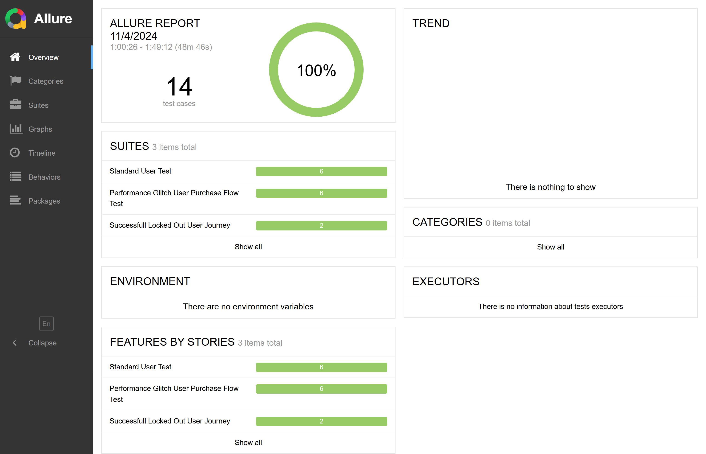

# 1. Clone the assignment file from github repository, link: https://github.com/nipamonalisa14/Final-Assignment.git

### Environment Setup
Clone the repository to your local computer
```
git clone https://github.com/nipamonalisa14/Final-Assignment.git
```
Use the package manager `npm` to install dependencies:
```
npm install
```

## Go to the VS Code terminal, then execute the following commands,
To initialize the node module: 
 ```
 npm init -y
 ```
To add the CLI package: 
```
npm i --save-dev @wdio/cli
``
To add a full WebdriverIO setup:
 ```
 npm init wdio@latest
 ```
## Run Code
To run specs, execute: 
```
npm run test
```
## To run suites, execute: 
```
npm run runspecFiles
```
## Allure Report Setup
```
npm install @wdio/allure-reporter --save-dev
```
## reporter ===>in wdio.config.js then
    <blockquote> 
            reporters: [['allure', {
            outputDir: 'allure-results',
            disableWebdriverStepsReporting: false,
            disableWebdriverScreenshotsReporting: false,
         }]],
    </blockquote>

 ```
 npm i allure-commandline
 ```
```
npm run test
```

## To get report, execute following command: 
    ```
    npm run getReport
    ```

## Screenshot
